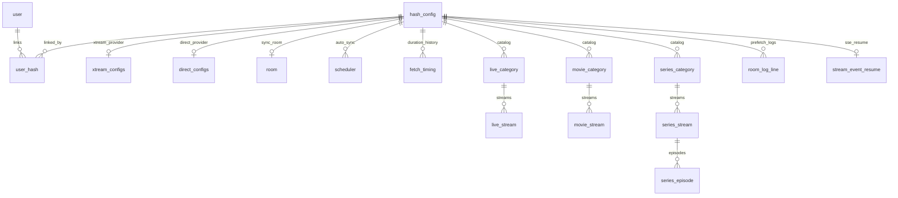

# FlumeTV API — client & data reference

**Last updated:** 2026-06-06

Contract reference for building a **custom management client** (web, mobile, or desktop) against FlumeTV-API. Covers REST + SSE request/response shapes, auth, Stremio addon URLs, and the PostgreSQL schema.

For **implementation context** (architecture, queue, room lifecycle, file layout), see [backend-reference.md](backend-reference.md).

| Doc                                                     | Use for                                                         |
| ------------------------------------------------------- | --------------------------------------------------------------- |
| [AGENTS.md](../AGENTS.md)                               | Agent onboarding — docs map, layering, conventions              |
| [backend-reference.md](backend-reference.md)            | Backend implementation — architecture, domain, runtime behavior |
| [README.md](../README.md)                               | Quick start, Docker, environment variables                      |
| [api-documentation.md](api-documentation.md)            | REST/SSE/Stremio contracts and PostgreSQL schema (this file)    |
| [api-error-codes.md](api-error-codes.md)                | REST `code` → HTTP status → remediation                         |
| [`src/types/rest.types.ts`](../src/types/rest.types.ts) | TypeScript mirrors of JSON bodies (when working in this repo)   |

Schema source of truth: [`db/migrations/`](../db/migrations/).

---

## Base URL and surfaces

| Surface           | Base path            | Auth                                                                          |
| ----------------- | -------------------- | ----------------------------------------------------------------------------- |
| **REST panel**    | `/api/...`           | httpOnly session cookie (JWT signed with `SESSION_JWT_SECRET`)                |
| **Stremio addon** | `/addon/{token}/...` | Encrypted URL token from `GET /api/stremio/manifest-url` (`ADDON_SECRET_KEY`) |

- **CORS:** Set `FRONTEND_ORIGIN` on the server to your client origin(s). Browser clients must send **`credentials: "include"`** on REST calls so the session cookie is stored and sent.
- **JSON bodies:** `Content-Type: application/json` unless noted.
- **`:hash` path param:** URL-encoded config hash (same hex string returned by config endpoints).

---

## Authentication

### REST session

| Item         | Value                                           |
| ------------ | ----------------------------------------------- |
| Cookie name  | `SESSION_COOKIE_NAME` (default `session`)       |
| Cookie flags | `httpOnly`; `Secure` when `NODE_ENV=production` |
| JWT claim    | `sub` = `userId` (UUID string)                  |
| Max age      | `SESSION_MAX_AGE_SECONDS` (default 7 days)      |

**Protected routes** return `401` with `AUTH_SESSION_MISSING` when the cookie is absent, or `403` with `AUTH_SESSION_INVALID` when the JWT is invalid/expired.

`POST /api/auth/register` and `POST /api/auth/login` are rate-limited (`AUTH_RATE_LIMIT_*`).

### Stremio addon token

- Issued only after REST login: `GET /api/stremio/manifest-url`.
- Payload identifies the **user** (`uuid` = `userId`), not a single config hash.
- Catalog/meta/stream routes serve data from that user's **`is_active`** configs only.

---

## Error responses

Failed REST calls return JSON:

```json
{ "code": "SOME_CODE", "message": "Human-readable detail" }
```

Branch on **`code`**; treat **`message`** as display text only. Full table: [api-error-codes.md](api-error-codes.md).

---

## REST API

### Auth — `/api/auth`

| Method | Path               | Auth    | Description                         |
| ------ | ------------------ | ------- | ----------------------------------- |
| `POST` | `/register`        | —       | Create account; sets session cookie |
| `POST` | `/login`           | —       | Sign in; sets session cookie        |
| `POST` | `/logout`          | —       | Clears session cookie               |
| `GET`  | `/me`              | Session | Current user                        |
| `POST` | `/change-password` | Session | Change password                     |

#### `POST /api/auth/register`

**Request**

```json
{ "password": "string (min 8 chars)" }
```

**Response `200`**

```json
{ "userId": "uuid" }
```

Server generates `userId`; save it after register (needed for login).

#### `POST /api/auth/login`

**Request**

```json
{ "userId": "uuid", "password": "string" }
```

**Response `200`**

```json
{ "userId": "uuid" }
```

#### `GET /api/auth/me`

**Response `200`**

```json
{ "userId": "uuid" }
```

#### `POST /api/auth/change-password`

**Request**

```json
{ "currentPassword": "string", "newPassword": "string (min 8)" }
```

**Response `200`**

```json
{ "ok": true }
```

#### `POST /api/auth/logout`

**Response `200`**

```json
{ "ok": true }
```

---

### Configs — `/api/configs` (session required)

| Method   | Path                      | Description                                 |
| -------- | ------------------------- | ------------------------------------------- |
| `GET`    | `/`                       | List linked configs                         |
| `POST`   | `/`                       | Link or create config                       |
| `PUT`    | `/:hash`                  | Rename or change provider (may change hash) |
| `DELETE` | `/:hash`                  | Unlink; server cascade when last user       |
| `GET`    | `/prefetch-status`        | Poll sync/queue snapshot                    |
| `GET`    | `/prefetch-status/stream` | SSE — live prefetch status (preferred)      |

#### Config request body (`POST` / `PUT`)

**`configName`** — required, trimmed, 1–200 characters. Per-user label only; **not** part of the provider hash.

**Xtream** (`type: "xtream"`)

| Field           | Required | Notes                              |
| --------------- | -------- | ---------------------------------- |
| `configName`    | yes      | Display name                       |
| `panelUrl`      | yes      | Public `http`/`https` only         |
| `panelUsername` | yes      |                                    |
| `panelPassword` | yes      | Stored encrypted; included in hash |
| `hasCustomEpg`  | no       | boolean                            |
| `customEpg`     | no       | string when custom EPG             |
| `epgUrl`        | no       | Public `http`/`https` if set       |
| `epgOffset`     | no       | integer minutes, default `0`       |

**Direct** (`type: "direct"`)

| Field          | Required | Notes                        |
| -------------- | -------- | ---------------------------- |
| `configName`   | yes      |                              |
| `m3uUrl`       | yes      | Public `http`/`https`        |
| `hasCustomEpg` | no       |                              |
| `epgUrl`       | no       | Public `http`/`https` if set |
| `epgOffset`    | no       | integer, default `0`         |

Private IPs, localhost, and blocked hostnames → `400 CONFIG_PROVIDER_URL_NOT_ALLOWED`.

#### `GET /api/configs`

**Response `200`**

```json
{
  "configs": [
    {
      "type": "xtream",
      "hash": "hex",
      "configName": "string",
      "isActive": true,
      "isRoomActive": false,
      "lastSyncedAt": "ISO8601 | null",
      "panelUrl": "string",
      "panelUsername": "string",
      "customEpg": "string | null",
      "epgUrl": "string | null",
      "hasCustomEpg": false,
      "epgOffset": 0,
      "roomId": 1,
      "roomStatus": "idle | queued | running | fetching | ...",
      "roomLastOutcome": "completed | failed | cancelled | error | null",
      "triggeredBy": "userId | scheduler | null",
      "triggeredByMe": true,
      "progress": { "percent": 0, "phase": "live", "bytesRead": 0, "bytesTotal": null },
      "scheduler": { "intervalMinutes": 1440, "nextTriggerAt": "ISO8601" }
    },
    {
      "type": "direct",
      "hash": "hex",
      "configName": "string",
      "m3uUrl": "string",
      "epgUrl": "string | null",
      "hasCustomEpg": false,
      "epgOffset": 0
    }
  ]
}
```

`isRoomActive` is `true` when `roomStatus` is `queued`, `running`, or `fetching`. `progress` is `null` when idle with no in-flight sync columns.

#### `POST /api/configs`

**Response `200`**

```json
{
  "hash": "hex",
  "created": true,
  "linkStatus": "created | linked-existing",
  "syncEnqueued": true,
  "enqueueErrorCode": null,
  "estimatedWaitMs": 120000,
  "queuePosition": 1,
  "roomId": 1,
  "roomStatus": "queued"
}
```

| Outcome                                   | Behavior                                                                                      |
| ----------------------------------------- | --------------------------------------------------------------------------------------------- |
| New provider hash                         | `created: true`, `linkStatus: "created"`, prefetch enqueued when queue accepts                |
| Hash exists globally, not on your account | `created: false`, `linkStatus: "linked-existing"`, no enqueue unless hash was new server-side |
| Hash already linked to you                | `409 CONFIG_ALREADY_EXISTS`; `message` includes existing `configName`                         |

#### `PUT /api/configs/:hash`

Same body as `POST`. Response is one of:

```json
{ "hash": "hex", "unchanged": true }
```

```json
{ "hash": "hex", "unchanged": false, "configNameUpdated": true }
```

```json
{
  "hash": "newHex",
  "unchanged": false,
  "oldHashUnlinked": true,
  "hashRemovedFromServer": true,
  "created": true,
  "linkStatus": "created | linked-existing",
  "syncEnqueued": true,
  "enqueueErrorCode": null,
  "estimatedWaitMs": null,
  "queuePosition": null,
  "roomId": 1,
  "roomStatus": "queued"
}
```

- Same computed hash + same stored name → `{ unchanged: true }`.
- Same hash, new `configName` only → `configNameUpdated: true` (no enqueue).
- Provider change → old hash unlinked (or removed for last user), bridge to new hash, may enqueue.

#### `DELETE /api/configs/:hash`

**Response `200`**

```json
{ "hashUnlinked": true, "hashRemovedFromServer": false }
```

`hashRemovedFromServer: true` when you were the last `user_hash` row for that hash (cascades catalog, room, scheduler, etc.).

---

### Hash operations — `/api/hashes/:hash` (session required)

| Method  | Path           | Description                   |
| ------- | -------------- | ----------------------------- |
| `POST`  | `/refetch`     | Enqueue catalog sync          |
| `POST`  | `/cancel`      | Cancel queued or running sync |
| `PATCH` | `/active`      | Toggle Stremio visibility     |
| `GET`   | `/room/events` | Per-hash room/queue SSE       |
| `GET`   | `/logs/stream` | Prefetch log SSE              |

#### `POST /api/hashes/:hash/refetch`

**Response `200`**

```json
{
  "syncEnqueued": true,
  "queuePosition": 2,
  "estimatedWaitMs": 240000,
  "roomId": 1,
  "roomStatus": "queued"
}
```

#### `POST /api/hashes/:hash/cancel`

**Response `200`**

```json
{ "cancelled": true, "kind": "queued" }
```

or `{ "cancelled": true, "kind": "running" }`.

Only the user in `room.triggered_by` may cancel (`403 HASH_CANCEL_NOT_AUTHORIZED` otherwise).

#### `PATCH /api/hashes/:hash/active`

**Request**

```json
{ "isActive": true }
```

**Response `200`**

```json
{ "hash": "hex", "isActive": true }
```

Inactive hashes are omitted from Stremio addon catalogs.

---

### Stremio install — `/api/stremio` (session required)

#### `GET /api/stremio/manifest-url`

**Response `200`**

```json
{
  "manifestUrl": "https://api.example.com/addon/{encryptedToken}/manifest.json",
  "stremioWebInstallUrl": "https://web.stremio.com/#?addon=..."
}
```

Use `manifestUrl` in Stremio; the path segment is the encrypted token, not a config hash.

---

## Server-Sent Events

All streams use:

- `Content-Type: text/event-stream; charset=utf-8`
- `Cache-Control: no-cache, no-transform`
- `Connection: keep-alive`
- Framing: `id: <n>\nevent: <name>\ndata: <json>\n\n`

Send session cookie on connect. Use **`Last-Event-ID`** on reconnect where noted.

### `GET /api/configs/prefetch-status/stream`

**Scope:** one connection per logged-in user (all linked hashes).

| Event          | `data` shape                                                                                 |
| -------------- | -------------------------------------------------------------------------------------------- |
| `snapshot`     | Full `GetConfigsPrefetchStatusResponseBody` (on connect)                                     |
| `hash`         | `{ "hash": "hex", "entry": ConfigPrefetchStatusEntry \| null }` — `entry: null` removes hash |
| `global_queue` | `{ "globalQueue": { "runningJobCount", "waitingJobCount", "totalQueueItems" } }`             |

**Poll equivalent:** `GET /api/configs/prefetch-status` returns the same body as `snapshot`.

**`ConfigPrefetchStatusEntry`** (per hash):

```json
{
  "hash": "hex",
  "hasLogs": true,
  "isTerminal": false,
  "lastSyncedAt": "ISO8601 | null",
  "nextTriggerAt": "ISO8601 | null",
  "schedulerIntervalMinutes": 1440,
  "estimatedWaitMs": null,
  "queuePosition": null,
  "triggeredBy": "userId | null",
  "triggeredByMe": true,
  "progress": { "percent": 42, "phase": "vod", "bytesRead": 0, "bytesTotal": null },
  "room": {
    "id": 1,
    "status": "running",
    "lastOutcome": "completed",
    "closedReason": null,
    "triggeredBy": "userId",
    "updatedAt": "ISO8601"
  }
}
```

`hasLogs`: persisted lines exist in `room_log_line` (open log stream to replay). Cleared when the next prefetch starts.

Progress updates on `hash` events are throttled (~`SYNC_PROGRESS_MIN_INTERVAL_MS`, default 500 ms).

### `GET /api/hashes/:hash/room/events`

**Scope:** one hash; requires `user_hash` link (`403 HASH_NOT_LINKED_TO_USER`).

| Event      | Purpose                                                      |
| ---------- | ------------------------------------------------------------ |
| `status`   | Room status, scheduler, `lastSyncedAt`, `isTerminal`         |
| `progress` | `{ "hash", "roomId", "progress": RoomSyncProgress \| null }` |
| `queue`    | Global queue depth + room snippet                            |
| `log`      | `logsTail` text snapshot (legacy tail field)                 |

Reconnect resumes event `id` via `stream_event_resume` per hash.

### `GET /api/hashes/:hash/logs/stream`

**Scope:** one hash; supports **`Last-Event-ID`** (log line `seq`) for replay after disconnect.

| Event       | Purpose                                                                                                         |
| ----------- | --------------------------------------------------------------------------------------------------------------- |
| `log`       | Structured line (see below)                                                                                     |
| `progress`  | `RoomSyncProgress` (bare object — e.g. `{ "percent": 42, "phase": "vod", "bytesRead": 0, "bytesTotal": null }`) |
| `log_reset` | New prefetch started — clear client log buffer                                                                  |

**`log` event payload (`RoomLogSsePayload`):**

```json
{
  "seq": 1,
  "line": "human text",
  "tone": "default | error | warning | success | info",
  "kind": "text | sector",
  "logKey": "sector-id",
  "sector": "Live",
  "status": "pending | in_progress | success | error",
  "bytesRead": 0,
  "bytesTotal": null,
  "sectorPercent": 50
}
```

Rows with the same `logKey` update in place; on replay, highest `seq` per `logKey` wins.

---

## Stremio addon HTTP

Mounted at `/addon/{token}` (encrypted user token).

| Method | Path                             | Response                                           |
| ------ | -------------------------------- | -------------------------------------------------- |
| `GET`  | `/manifest.json`                 | Stremio manifest JSON                              |
| `GET`  | `/configure`                     | **302** → `{FRONTEND_ORIGIN}/config?uuid={userId}` |
| `GET`  | `/catalog/:type/:id/:extra.json` | Catalog page                                       |
| `GET`  | `/catalog/:type/:id.json`        | Catalog                                            |
| `GET`  | `/meta/:type/:id.json`           | Meta                                               |
| `GET`  | `/stream/:type/:id.json`         | `{ "streams": [{ "url": "..." }] }`                |

No session cookie. Only **active** user configs contribute catalog data.

---

## Domain rules (for clients)

### Config hash (deduplication)

SHA-256 of canonical JSON (stable key order). Identical provider credentials share one server catalog.

| Type       | Hash includes                                                  |
| ---------- | -------------------------------------------------------------- |
| **Xtream** | Normalized `panelUrl`, EPG options, **username**, **password** |
| **Direct** | Normalized `m3uUrl`, EPG options (URL userinfo affects hash)   |

`configName` is **never** in the hash. Multiple users link the same hash via separate `user_hash` rows.

### Room (sync job) lifecycle

One `room` row per hash for its lifetime.

**`room.status`**

| Value                                       | Meaning                                  |
| ------------------------------------------- | ---------------------------------------- |
| `idle`                                      | No active sync                           |
| `queued`                                    | Waiting in prefetch queue                |
| `running` / `fetching`                      | Worker active — blocks duplicate enqueue |
| `completed`, `failed`, `cancelled`, `error` | Terminal (brief) before return to `idle` |

**`room.last_outcome`** — result of the **last finished** run (`completed` \| `failed` \| `cancelled` \| `error` \| `null`). Not cleared when a new run starts; use for “last result” UI.

**`room.closed_reason`** — detail string (e.g. `user_cancelled`, `process_restarted`). Cleared on successful idle reset / new enqueue.

**Progress** (`sync_percent`, `sync_phase`, `sync_bytes_read`, `sync_bytes_total`) — cleared when room returns to `idle`. Exposed as `progress` on list, prefetch-status, and SSE.

### Queue

- FIFO prefetch queue; concurrency `FETCH_PARALLELISM` (default 4).
- Enqueue sources: new config, scheduler due, manual refetch.
- `429 QUEUE_BACKLOG_EXCEEDED` when estimated wait exceeds `FETCH_MAX_BACKLOG_HOURS` (~20h).

### Scheduler

Per-hash `scheduler` row: `next_trigger_at`, `interval_minutes` (default 1440). Scheduler-triggered jobs use synthetic `triggered_by = "scheduler"`.

### Shared hash on delete

`DELETE` always removes your `user_hash` row. `hash_config` and all catalog data are deleted only when **no other users** reference the hash.

---

## Database architecture

PostgreSQL 16. Migrations: `001_initial_schema.sql`, `002_indexes_and_search.sql` (`pg_trgm` for catalog name search).

### Entity relationship



### Core tables

#### `user`

| Column          | Type    | Notes  |
| --------------- | ------- | ------ |
| `user_id`       | TEXT PK | UUID   |
| `password_hash` | TEXT    | Argon2 |

#### `user_hash`

| Column        | Type                    | Notes                          |
| ------------- | ----------------------- | ------------------------------ |
| `user_id`     | TEXT FK → `user`        | CASCADE delete                 |
| `hash`        | TEXT FK → `hash_config` | CASCADE delete                 |
| `config_name` | TEXT                    | Per-user display name          |
| `is_active`   | BOOLEAN                 | Default `true`; Stremio filter |

PK: `(user_id, hash)`.

#### `hash_config`

| Column           | Type               | Notes                                   |
| ---------------- | ------------------ | --------------------------------------- |
| `hash`           | TEXT PK            | SHA-256 hex                             |
| `config_type`    | TEXT               | `xtreme` \| `direct` (DB enum spelling) |
| `room_id`        | BIGINT FK → `room` | SET NULL on room delete                 |
| `last_synced_at` | TIMESTAMPTZ        | Updated on successful sync              |

#### `room`

| Column                     | Type             | Notes                                             |
| -------------------------- | ---------------- | ------------------------------------------------- |
| `id`                       | BIGSERIAL PK     |                                                   |
| `triggered_by`             | TEXT FK → `user` | Or `scheduler` synthetic user                     |
| `status`                   | TEXT             | See lifecycle above                               |
| `sync_percent`             | INTEGER          | 0–100                                             |
| `sync_phase`               | TEXT             | e.g. `auth`, `live`, `vod`, `series`, `m3u`, `db` |
| `sync_bytes_read`          | INTEGER          |                                                   |
| `sync_bytes_total`         | INTEGER          |                                                   |
| `logs_tail`                | TEXT             | Legacy tail                                       |
| `closed_reason`            | TEXT             |                                                   |
| `last_outcome`             | TEXT             | `completed` \| `failed` \| `cancelled` \| `error` |
| `created_at`, `updated_at` | TIMESTAMPTZ      |                                                   |

#### `xtream_configs`

| Column                                                  | Type                    | Notes             |
| ------------------------------------------------------- | ----------------------- | ----------------- |
| `hash_id`                                               | TEXT FK → `hash_config` | CASCADE           |
| `url`                                                   | TEXT                    | Panel URL         |
| `username`                                              | TEXT                    |                   |
| `password_enc`                                          | TEXT                    | Encrypted at rest |
| `custom_epg`, `has_custom_epg`, `epg_url`, `epg_offset` |                         | EPG options       |

#### `direct_configs`

| Column                                    | Type                    | Notes   |
| ----------------------------------------- | ----------------------- | ------- |
| `hash_id`                                 | TEXT FK → `hash_config` | CASCADE |
| `m3u_url`                                 | TEXT                    |         |
| `epg_url`, `has_custom_epg`, `epg_offset` |                         |         |

#### `scheduler`

| Column             | Type           | Notes        |
| ------------------ | -------------- | ------------ |
| `hash_id`          | TEXT UNIQUE FK | CASCADE      |
| `next_trigger_at`  | TIMESTAMPTZ    |              |
| `interval_minutes` | INTEGER        | Default 1440 |

#### `fetch_timing`

| Column    | Type    | Notes                                        |
| --------- | ------- | -------------------------------------------- |
| `hash_id` | TEXT FK | Completed sync durations for queue estimates |

#### `room_log_line`

| Column                                        | Type      | Notes              |
| --------------------------------------------- | --------- | ------------------ |
| `hash`, `seq`                                 | PK        | Monotonic per hash |
| `line`, `tone`, `kind`                        | TEXT      | SSE log payload    |
| `log_key`, `sector`, `status`                 | TEXT      | Sector rows        |
| `bytes_read`, `bytes_total`, `sector_percent` | INTEGER   |                    |
| `room_id`                                     | BIGINT FK | Optional           |

Logs persist after sync until the next run (then wiped + `log_reset` SSE).

#### `stream_event_resume`

| Column              | Type    | Notes           |
| ------------------- | ------- | --------------- |
| `hash`              | TEXT PK |                 |
| `last_sequence`     | INTEGER | Room events SSE |
| `last_log_sequence` | INTEGER | Log stream SSE  |

### Catalog tables (per `hash`)

Replaced atomically on each successful sync (delete all rows for hash, insert new tree).

| Table                              | Role                                                      |
| ---------------------------------- | --------------------------------------------------------- |
| `live_category`, `live_stream`     | Live TV                                                   |
| `movie_category`, `movie_stream`   | VOD                                                       |
| `series_category`, `series_stream` | Series                                                    |
| `series_episode`                   | Direct M3U episodes; Xtream episodes fetched at meta time |

Streams reference `category_internal_id` → category row. Indexes on `(hash, name)` and trigram GIN on `name` for search.

#### `stream_fetch_status`

Links `room_id` + `hash_id` during active fetch tracking.

### Cascade summary

| Action                           | Effect                                                                           |
| -------------------------------- | -------------------------------------------------------------------------------- |
| Delete `user`                    | Cascades `user_hash`                                                             |
| Delete last `user_hash` for hash | Deletes `hash_config` → provider, catalog, scheduler, logs, room (via app logic) |
| Delete `hash_config`             | Cascades provider + catalog + `scheduler` + `fetch_timing` + `room_log_line`     |

---

## Related documentation

| Document                                                                                                | Purpose                                          |
| ------------------------------------------------------------------------------------------------------- | ------------------------------------------------ |
| [README.md](../README.md)                                                                               | Deploy, env vars, self-hosting                   |
| [backend-reference.md](backend-reference.md)                                                            | Implementation architecture and runtime behavior |
| [api-error-codes.md](api-error-codes.md)                                                                | REST error codes                                 |
| [`.cursor/rules/backend-reference-maintenance.mdc`](../.cursor/rules/backend-reference-maintenance.mdc) | When and how agents update these docs            |

When REST contracts or schema change, update this file and [api-error-codes.md](api-error-codes.md) in the same change.
