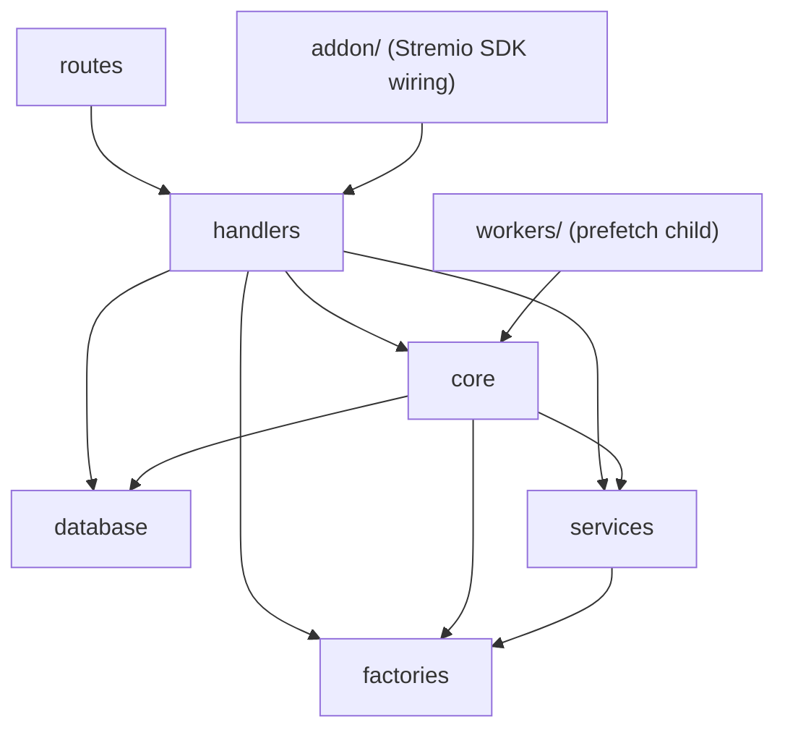
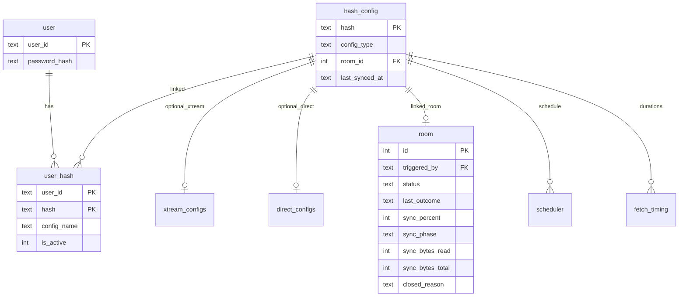

# FlumeTV API — backend reference

**Last updated:** 2026-06-12

**Source of truth for backend implementation** — architecture, module layout, domain model, runtime behavior (queue, scheduler, room lifecycle, SSE, sync), and how the codebase fits together. Start here when working in this repository as an agent or contributor.

### Documentation map

| Document                                                                                                    | Role                                                                                                      |
| ----------------------------------------------------------------------------------------------------------- | --------------------------------------------------------------------------------------------------------- |
| **`backend-reference.md` (this file)**                                                                      | Implementation context — layers, flows, domain rules, file pointers                                       |
| [`api-documentation.md`](api-documentation.md)                                                              | **External contracts** — REST/SSE request/response shapes, Stremio addon URLs, PostgreSQL table reference |
| [`api-error-codes.md`](api-error-codes.md)                                                                  | REST `code` → HTTP status → remediation                                                                   |
| [`README.md`](../README.md)                                                                                 | Self-hosting — Docker, environment variables                                                              |
| [`AGENTS.md`](../AGENTS.md)                                                                                 | Agent onboarding — docs map, layering, conventions                                                        |
| [`.cursor/rules/`](../.cursor/rules/)                                                                       | Layering, naming, code style                                                                              |
| [FlumeTV-UI frontend-reference](https://github.com/TonyCJ7/FlumeTV-UI/blob/main/docs/frontend-reference.md) | Official UI integration (cross-repo)                                                                      |

---

## Overview

FlumeTV-API is a Node.js **Express** service that powers a self-hostable **Stremio IPTV addon** and a **REST API** for the FlumeTV config UI.

| Surface           | Base path           | Auth                                                                        |
| ----------------- | ------------------- | --------------------------------------------------------------------------- |
| **REST panel**    | `/api/...`          | httpOnly session cookie (JWT signed with `SESSION_JWT_SECRET`)              |
| **Stremio addon** | `/addon/:token/...` | Encrypted URL token (`encodeToken` / `decodeToken` with `ADDON_SECRET_KEY`) |

**Persistence:** **PostgreSQL** via `pg` connection pool; `DATABASE_URL` is required. SQL schema lives in [`db/migrations/`](../db/migrations/); apply updates with **`npm run db:migrate`** (or on HTTP startup). Table name constants: [`src/constants/dbBuild.constants.ts`](../src/constants/dbBuild.constants.ts).

**Entry point:** [`src/index.ts`](../src/index.ts) — initializes DB, starts scheduler loop, mounts `/api` and `/addon/:config_hash` Stremio routes.

---

## Architecture

### Import direction (no cycles)



- **`routes`** — thin Express routers; delegate to **`handlers`**
- **`handlers`** — HTTP/Stremio entry; orchestrate lower layers
- **`core`** — queues, scheduler, prefetch jobs, SSE broadcasters, room lifecycle
- **`services`** — outbound HTTP (axios); normalize at the API boundary
- **`factories`** — pure mappers (no I/O, no `pool.query`)
- **`database`** — SQL only
- **`utils`** — small pure helpers
- **`workers`** — child-process entry for prefetch sync only

Detailed layering rules: [`.cursor/rules/addon-layering.mdc`](../.cursor/rules/addon-layering.mdc), [`.cursor/rules/backend-architecture-flow.mdc`](../.cursor/rules/backend-architecture-flow.mdc).

### Source layout

| Area              | Location                            | Role                                             |
| ----------------- | ----------------------------------- | ------------------------------------------------ |
| Express routers   | `src/routes/`                       | `auth`, `config`, `room`, `stremio`, `addon`     |
| Middleware        | `src/middleware/`                   | `requireAuth`, rate limits, request logging      |
| HTTP handlers     | `src/handlers/`                     | REST + Stremio (`addon*.handler.ts`)             |
| Orchestration     | `src/core/`                         | Queue, scheduler, sync jobs, SSE, room lifecycle |
| Outbound I/O      | `src/services/`                     | Xtream/Direct catalog and meta fetches           |
| Pure mappers      | `src/factories/`                    | Panel/DB rows → typed/Stremio shapes             |
| PostgreSQL (`pg`) | `src/database/`                     | SQL per `*.db.ts` module + pool utilities        |
| Stremio SDK       | `src/addon/addon.ts`                | `addonBuilder` handler registration              |
| Worker entry      | `src/workers/prefetchSyncWorker.ts` | Child process sync runner                        |
| Types / constants | `src/types/`, `src/constants/`      | Types only vs literals/env                       |

**Do not** add a `controllers/` layer or ad-hoc migration runners outside `db/migrations/`.

---

## Domain model

### Entity relationships



### Core concepts

- **User** — UUID `user_id`, Argon2 password hash. Created via `POST /api/auth/register`.
- **Hash (config hash)** — SHA-256 of canonical provider JSON. Dedupes identical Xtream panels or M3U URLs. Multiple users can link the same hash via **`user_hash`**.
- **`configName`** — Per-user display label on `user_hash.config_name`. **Not** part of the hash payload.
- **`is_active`** — On `user_hash`. Only active hashes appear in Stremio catalogs (`listActiveHashes`).
- **Provider rows** — `xtream_configs` (panel URL, username, `password_enc`) or `direct_configs` (M3U/EPG URLs). One row per hash.
- **Room** — One stable linked `room` row per hash for its lifetime. Tracks sync state, progress, and log buffer. See [Room lifecycle](#room-lifecycle).
- **Scheduler** — Per-hash `next_trigger_at` and interval. Due rows enqueue prefetch jobs.
- **`fetch_timing`** — Completed sync durations; used for queue wait estimates and progress time fallback.

### Config hash rules

Implemented in [`src/utils/configHash.utils.ts`](../src/utils/configHash.utils.ts).

| Type       | Hash input includes                                                      |
| ---------- | ------------------------------------------------------------------------ |
| **Xtream** | Normalized panel URL, EPG options, **username**, **password**            |
| **Direct** | Normalized `m3u_url`, `epg_url`, EPG options (URL userinfo affects hash) |

Panel passwords at rest: `password_enc` via `encryptSecretForStorage` (same key material as addon tokens). User login passwords use a separate Argon2 hash on `user`.

---

## Authentication

### REST session (JWT cookie)

- Sign/verify: [`src/utils/session.utils.ts`](../src/utils/session.utils.ts)
- Secret: **`SESSION_JWT_SECRET`** (never reuse `ADDON_SECRET_KEY`)
- Cookie: `SESSION_COOKIE_NAME` (default `session`), httpOnly, `Secure` in production
- Middleware: [`requireAuth`](../src/middleware/auth.middleware.ts) sets `req.userId` from JWT `sub`

### Stremio addon token

- Crypto: [`src/utils/crypto.utils.ts`](../src/utils/crypto.utils.ts)
- Payload: `{ uuid: "<userId>" }` — identifies which user's active configs to serve
- Issued via `GET /api/stremio/manifest-url` after login

These two secrets and token formats must stay separate.

---

## REST API summary

Full route tables and request/response shapes: [api-documentation.md](api-documentation.md).

| Area                | Key endpoints                                                                       |
| ------------------- | ----------------------------------------------------------------------------------- |
| **Auth**            | `POST /api/auth/register`, `login`, `logout`, `change-password`; `GET /api/auth/me` |
| **Configs**         | `GET/POST /api/configs`, `PUT/DELETE /api/configs/:hash`                            |
| **Prefetch status** | `GET /api/configs/prefetch-status`, `GET .../prefetch-status/stream` (SSE)          |
| **Hash ops**        | `POST /api/hashes/:hash/refetch`, `cancel`; `PATCH .../active`                      |
| **Room / logs**     | `GET /api/hashes/:hash/room/events`, `GET .../logs/stream` (SSE)                    |
| **Stremio install** | `GET /api/stremio/manifest-url`                                                     |

POST/PUT config bodies require **`configName`** (trimmed, 1–200 chars). Provider body is discriminated: `type: "xtream" | "direct"`.

**Provider URLs:** `panelUrl`, `m3uUrl`, and non-empty `epgUrl` must be public **`http`** or **`https`** URLs. Private IP ranges, localhost, and cloud metadata hostnames are rejected at POST/PUT with **`400 CONFIG_PROVIDER_URL_NOT_ALLOWED`**. The same guard runs on outbound sync/meta fetches (defense in depth).

**POST `/api/configs`:** Creates a new `user_hash` link. If the computed provider hash already exists on the server but is **not** linked to the caller, the bridge row is inserted and the response uses **`linkStatus: "linked-existing"`** (shared catalog, no new prefetch unless the hash was newly created). If the caller **already** has that hash linked, the API returns **`409 CONFIG_ALREADY_EXISTS`** with the existing display name in **`message`** — POST must not rename or overwrite an existing link (use **PUT** for renames or provider changes).

Shared hash semantics on **DELETE**: always unlink caller's `user_hash`; delete `hash_config` and cascade only when no other users reference the hash.

---

## Stremio addon HTTP

First-party routes in [`src/routes/addon.route.ts`](../src/routes/addon.route.ts) (replaces SDK `getRouter`). Mounted at `/addon/:config_hash` where the param is the encrypted token (`ADDON_HTTP_MOUNT_PREFIX` in [`common.constants.ts`](../src/constants/common.constants.ts)).

| Route                                          | Handler role                                   |
| ---------------------------------------------- | ---------------------------------------------- |
| `GET /manifest.json`                           | Addon manifest                                 |
| `GET /configure`                               | 302 → `{FRONTEND_ORIGIN}/config?uuid=<userId>` |
| `GET /catalog/...`, `/meta/...`, `/stream/...` | Catalog, meta, playback URLs                   |

Handlers decode the token, resolve the user's **active** hashes, and serve synced catalog data. Stream responses return `{ streams: [{ url, behaviorHints? }] }` from M3U rows or Xtream panel URLs — optionally proxied through MediaFlow or marked `behaviorHints.notWebReady` when proxy is inactive ([`addonStream.handler.ts`](../src/handlers/addonStream.handler.ts), [`streamPlayback.factory.ts`](../src/factories/streamPlayback.factory.ts)).

**Catalog search** (`extra.search` on catalog routes): [`getCatalogs()`](../src/database/catalog.db.ts) filters stream names across active hashes. Terms shorter than **`CATALOG_SEARCH_FUZZY_MIN_LENGTH`** (3) use case-insensitive substring match only (`ILIKE`). Longer terms add **`pg_trgm`** fuzzy match (`similarity` / `word_similarity` at **`CATALOG_SEARCH_SIMILARITY_THRESHOLD`**, 0.4) and rank results — substring hits first, then highest similarity, then name. Genre filter and pagination (`skip`, 100 per page) are unchanged. Existing GIN trigram indexes on stream `name` columns support the query.

### MediaFlow stream proxy (optional)

When `MEDIAFLOW_PROXY_URL` and `MEDIAFLOW_PROXY_API_PASSWORD` are set and `user.has_proxy`, addon **stream** and **meta** handlers POST to `{MEDIAFLOW_PROXY_URL}/generate_urls` for every **`http://` and `https://`** playback URL. Each item uses `endpoint: "/proxy/stream"`. Optional `MEDIAFLOW_PROXY_TRANSCODE` (`1` / `true` / `yes`) adds `query_params: { transcode: "true" }` (default off — pass-through). When **`MEDIAFLOW_PROXY_TRANSCODE`** is on, or when **`MEDIAFLOW_PROXY_RESOLVE_REDIRECTS`** is set, [`playbackRedirect.services.ts`](../src/services/playbackRedirect.services.ts) resolves panel HTTP redirects (e.g. Xtream panel → CDN token URL) via `outboundAxios` before `generate_urls` so MediaFlow receives the public CDN URL. Catalog sync and DB rows keep canonical panel URLs unchanged. When proxy is inactive (`!isStreamProxyConfigured()` or `!has_proxy`), responses include **`behaviorHints.notWebReady: true`** on streams (including `meta.videos[].streams`). Xtream live extension: panel row `container_extension` when present; else `user_info.allowed_output_formats` from sync auth (prefers **`ts`**, then **`m3u8`**); playback fallback **`ts`** via [`resolveLiveContainerExtension()`](../src/utils/xtreamMeta.utils.ts).

| Module                                                                                                                               | Role                                                                                                                                                                       |
| ------------------------------------------------------------------------------------------------------------------------------------ | -------------------------------------------------------------------------------------------------------------------------------------------------------------------------- |
| [`streamProxy.constants.ts`](../src/constants/streamProxy.constants.ts), [`streamProxy.utils.ts`](../src/utils/streamProxy.utils.ts) | Env literals, `isStreamProxyConfigured()`, proxiable URL detection (`isProxiablePlaybackUrl`), public-URL rewrite                                                          |
| [`mediaflowProxy.services.ts`](../src/services/mediaflowProxy.services.ts)                                                           | Dedicated axios instance (not `outboundAxios` — SSRF guard blocks private/docker MediaFlow hosts); optional redirect resolve before `generate_urls`                         |
| [`playbackRedirect.services.ts`](../src/services/playbackRedirect.services.ts)                                                       | Resolves panel playback redirects to public CDN URLs via `outboundAxios` (SSRF-guarded); used when transcode or `MEDIAFLOW_PROXY_RESOLVE_REDIRECTS` is enabled              |
| [`streamProxy.factory.ts`](../src/factories/streamProxy.factory.ts)                                                                  | Pure collect/apply helpers for `Stream[]` and `MetaDetail.videos[].streams`                                                                                                |
| [`applyStreamProxy.ts`](../src/core/applyStreamProxy.ts)                                                                             | Orchestrates gate + fetch + apply in [`addonStream.handler.ts`](../src/handlers/addonStream.handler.ts) and [`addonMeta.handler.ts`](../src/handlers/addonMeta.handler.ts) |
| [`userProxyReconcile.ts`](../src/core/userProxyReconcile.ts)                                                                         | On HTTP startup (after DB init), syncs per-user `has_proxy` from env via [`streamProxy.db.ts`](../src/database/streamProxy.db.ts)                                           |

**Self-host modes:** set both `MEDIAFLOW_*` credentials → all users proxied when configured; omit all `MEDIAFLOW_*` → proxy off and `has_proxy` cleared for everyone. Optional `MEDIAFLOW_PROXY_PUBLIC_URL` rewrites the host on returned proxy links when MediaFlow is reached on an internal URL (e.g. Docker network). Optional `MEDIAFLOW_PROXY_TRANSCODE` enables browser-oriented transcoding on the proxy host. [MediaFlow Proxy Light](https://github.com/mhdzumair/MediaFlow-Proxy-Light) is API-compatible with the Python proxy (`/generate_urls`, `/proxy/stream`). On MediaFlow errors, handlers return the original playback URL (safe-shape).

**Per-user gate (`user.has_proxy`):** Addon handlers call [`getUserHasProxy()`](../src/database/user.db.ts) before wrapping. Migration [`003_user_stream_proxy.sql`](../db/migrations/003_user_stream_proxy.sql) adds `user.has_proxy` (and legacy `stream_proxy_state`, unused). Startup reconcile bulk-updates `has_proxy` on every API restart from current env.

**Operator rollout (implementation only — not in README, `.env.example`, or REST):** Hidden env `PROXY_ACCEPTED_USERS` (comma-separated user UUIDs). Parsed by [`parseProxyAcceptedUserIds()`](../src/utils/streamProxy.utils.ts). When MediaFlow is configured: unset or empty → reconcile sets `has_proxy=true` for all users; set → only listed UUIDs get `has_proxy=true`. Restart the API after changes. No panel UI; reserved for gradual rollout. Documented here and in code only.

SDK wiring for handler registration: [`src/addon/addon.ts`](../src/addon/addon.ts).

---

## Prefetch queue and scheduler

### Three enqueue sources

All use the same FIFO queue ([`src/core/prefetchSyncQueue.ts`](../src/core/prefetchSyncQueue.ts)):

1. **New config** — `POST /api/configs` with `created: true`
2. **Scheduler** — [`src/core/schedulerDue.ts`](../src/core/schedulerDue.ts) polls due `scheduler` rows
3. **Manual refetch** — `POST /api/hashes/:hash/refetch`

### Queue behavior

- **Concurrency:** `FETCH_PARALLELISM` (default 4) running child workers
- **Backlog guard:** Rejects enqueue when estimated wait exceeds `FETCH_MAX_BACKLOG_HOURS` (~20h) → `QUEUE_BACKLOG_EXCEEDED`
- **Wait estimates:** From `fetch_timing` averages (fallback `DEFAULT_FETCH_DURATION_MS_ESTIMATE`)
- **Execution:** Each running job spawns an OS child ([`prefetchSyncWorkerProcess.ts`](../src/core/prefetchSyncWorkerProcess.ts) → [`prefetchSyncWorker.ts`](../src/workers/prefetchSyncWorker.ts))
- **Cancel:** `killPrefetchWorker` sends SIGTERM; queue marks `cancelled` when user-initiated

### Catalog sync jobs

| Provider       | Core module             | Service                     | Persist                   |
| -------------- | ----------------------- | --------------------------- | ------------------------- |
| **Xtream**     | `xtreamPrefetchSync.ts` | `xtreamCatalog.services.ts` | `xtreamCatalogSync.db.ts` |
| **Direct M3U** | `directPrefetchSync.ts` | `directCatalog.services.ts` | `directCatalogSync.db.ts` |

**Replace semantics:** On success, a single PostgreSQL transaction (`withPgTransaction` in `xtreamCatalogSync.db.ts` / `directCatalogSync.db.ts`) deletes all prior catalog rows for the hash, inserts the new tree, updates `hash_config.last_synced_at`, then sets the linked room **`idle`** with **`last_outcome: completed`**.

- **Xtream:** Episodes come from `get_series_info` at meta time; sync stores series streams only (`series_episode` cascades on delete).
- **Direct:** M3U parse inserts `series_episode` rows from playlist markers.

---

## Room lifecycle

Each config hash keeps **one linked `room` row** for its lifetime.

### Status flow

```
idle → queued → running → (completed | failed | cancelled | error) → idle
```

- **`idle`** — Steady state when no sync is active. Created when hash is first persisted.
- **Active sync:** `queued`, `running`, `fetching` — block duplicate enqueue for same hash.
- **Terminal:** `cancelled`, `completed`, `failed`, `error` — transient before reset to `idle`.
- **`last_outcome`** — Persisted result of the most recent **finished** sync run (`completed` | `failed` | `cancelled` | `error` | `null`). **Not cleared** when a new run is enqueued; updated only when a run finishes. Use this for “last outcome” UI while `status` reflects the current run (`idle`, `queued`, `running`, …).
- **`closed_reason`** — Detail string for the last close (error message, `process_restarted`, `user_cancelled`, etc.). Cleared on successful idle reset and when a new run is enqueued; retained after failure until the room resets to `idle`.

### Log buffer

- Persisted in `room_log_line`; streamed via log SSE
- **Kept after sync** — logs remain available after terminal status so clients can open `/logs/stream` later and replay the run
- **New run only:** `preemptRoomLogsForNewRun` wipes logs and broadcasts `event: log_reset`
- **Room row** is deleted only on **last-user** `DELETE /api/configs/:hash` (cascade), not after each sync

Constants: [`src/constants/room.constants.ts`](../src/constants/room.constants.ts). Orchestration: [`src/core/roomLifecycle.ts`](../src/core/roomLifecycle.ts).

**Server crash / restart:** On boot, [`sweepTerminalRoomsOnStartup`](../src/core/roomLifecycle.ts) marks orphaned active rooms `failed` with `closed_reason = process_restarted`, sets `last_outcome = failed`, appends an error-toned log line (`"Server restarted during sync"`) to `room_log_line`, then resets to `idle` (keeping `last_outcome` and log buffer). Clients see the line on log SSE replay after reconnect — no live SSE is sent during boot.

---

## Server-Sent Events

### Room events — `GET /api/hashes/:hash/room/events`

Broadcaster: [`roomSseBroadcaster.ts`](../src/core/roomSseBroadcaster.ts). Events include `status`, `progress`, `queue`. Reconnect uses `stream_event_resume`.

### Log stream — `GET /api/hashes/:hash/logs/stream`

Broadcaster: [`roomLogSseBroadcaster.ts`](../src/core/roomLogSseBroadcaster.ts).

| Event       | Purpose                                                                                 |
| ----------- | --------------------------------------------------------------------------------------- |
| `log`       | Structured line (`RoomLogSsePayload`: `tone`, `logKey`, sector `status`, byte progress) |
| `progress`  | Overall sync percent                                                                    |
| `log_reset` | Client must clear in-memory log buffer (new run)                                        |

Sector rows with the same `logKey` update in place. On reconnect, merge replay by `logKey` (highest `seq` wins).

### Prefetch status — `GET /api/configs/prefetch-status/stream`

User-scoped (one connection per logged-in user). Broadcaster: [`configsPrefetchStatusSseBroadcaster.ts`](../src/core/configsPrefetchStatusSseBroadcaster.ts).

| Event          | Data                                                    |
| -------------- | ------------------------------------------------------- |
| `snapshot`     | Full `GetConfigsPrefetchStatusResponseBody` on connect  |
| `hash`         | Single hash entry upsert or removal (`entry: null`)     |
| `global_queue` | `{ runningJobCount, waitingJobCount, totalQueueItems }` |

Poll fallback: `GET /api/configs/prefetch-status`. Snapshot builder: [`configsPrefetchStatusSnapshot.ts`](../src/core/configsPrefetchStatusSnapshot.ts).

Each `byHash` entry includes **`hasLogs`** (`boolean`) — `true` when persisted prefetch log lines exist in `room_log_line` for that hash. Logs are kept after a sync finishes and cleared only when the next prefetch is enqueued. Use **`hasLogs`** to show a “View logs” affordance on the config list; open **`GET /api/hashes/:hash/logs/stream`** to replay. Updates on the same SSE **`hash`** events as room status (run finish, new enqueue / log wipe).

Progress events throttled at `SYNC_PROGRESS_MIN_INTERVAL_MS` (default 500 ms).

---

## Sync progress

Persisted on `room`: `sync_percent`, `sync_phase`, `sync_bytes_read`, `sync_bytes_total`.

**Hybrid percent** ([`syncProgress.utils.ts`](../src/utils/syncProgress.utils.ts)):

- Uses download bytes when `Content-Length` is known
- Falls back to elapsed time vs `fetch_timing` estimate when size unknown
- Phase-weighted slices cap in-flight percent below step completion

Surfaces: config list, prefetch-status poll/SSE, room SSE, log SSE `progress` event. Cleared when room returns to `idle`.

Worker reports progress via stdout lines parsed in the parent process.

---

## Database notes

Full table/column reference: [api-documentation.md — Database architecture](api-documentation.md#database-architecture).

- **Bootstrap:** [`src/database/index.ts`](../src/database/index.ts) — runs pending migrations on startup, ensures scheduler user row
- **Schema source:** [`db/migrations/`](../db/migrations/) (applied by [`migrate.db.ts`](../src/database/migrate.db.ts))
- **Pool:** [`pgPool.utils.ts`](../src/database/pgPool.utils.ts) — `PG_POOL_MAX` (HTTP), `PG_POOL_MAX_WORKER` (worker children)
- **Transactions:** [`pgTransaction.utils.ts`](../src/database/pgTransaction.utils.ts) — `withPgTransaction` for multi-step catalog replace
- **Catalog reads:** [`catalog.db.ts`](../src/database/catalog.db.ts), [`common.db.ts`](../src/database/common.db.ts)
- **Config CRUD:** [`providerConfig.db.ts`](../src/database/providerConfig.db.ts)
- **One `pool.query` per function** — multi-step writes via **`withPgTransaction`**

Main catalog tables per hash: `live_*`, `movie_*`, `series_*` categories and streams; Direct adds `series_episode`.

---

## Production and workers

| Command               | Behavior                                                             |
| --------------------- | -------------------------------------------------------------------- |
| `npm run dev`         | Docker dev stack — Postgres + API with `tsx watch`                   |
| `npm run start`       | Docker production stack — pulls **`tonycj7/flumetv-api:latest`**     |
| `npm run build`       | `tsc` + `tsc-alias` → `dist/`                                        |
| `npm run dev:local`   | Host `tsx watch`; set `DATABASE_URL`                                 |
| `npm run start:local` | Host `node dist/index.js` after build                                |
| `npm run db:migrate`  | `tsx src/scripts/runMigrations.ts` — pending SQL in `db/migrations/` |

**Worker env (internal):**

- `PREFETCH_SYNC_WORKER=1` — set inside child only; uses smaller `PG_POOL_MAX_WORKER` (default 2)
- `PREFETCH_WORKER_NODE_OPTIONS` — e.g. `--max-old-space-size=4096`
- `PREFETCH_WORKER_SCRIPT` — override worker entry path

**Docker:** Published image **[`tonycj7/flumetv-api:latest`](https://hub.docker.com/r/tonycj7/flumetv-api)**; [`docker-compose.yml`](../docker-compose.yml) brings up **PostgreSQL** and the API (`depends_on` + healthcheck). Set `DATABASE_URL` in `.env` (defaults in compose point at the `postgres` service).

Child processes reuse the same **`DATABASE_URL`** and open their own **pool** (`PG_POOL_MAX_WORKER` caps the worker pool). The main process owns HTTP, queue orchestration, and SSE; workers run fetch/parse/DB replace transactions.

---

## Frontend integration

The FlumeTV frontend lives at sibling **`../FlumeTV-UI`** ([FlumeTV-UI](https://github.com/TonyCJ7/FlumeTV-UI)).

Authoritative UI context: [FlumeTV-UI/docs/frontend-reference.md](../../FlumeTV-UI/docs/frontend-reference.md).

Cross-stack touchpoints: session cookie auth, config list + prefetch-status SSE, log stream payload types, Stremio install URLs, `/configure?uuid=` redirect.

**Not wired in UI (v1):** per-hash **`GET /api/hashes/:hash/room/events`** (UI uses prefetch-status SSE instead); global queue depth has no chrome (stored in Redux only).

---

## Related documentation

| Document                                                                                                | Purpose                                          |
| ------------------------------------------------------------------------------------------------------- | ------------------------------------------------ |
| [api-documentation.md](api-documentation.md)                                                            | REST/SSE/Stremio contracts and PostgreSQL schema |
| [api-error-codes.md](api-error-codes.md)                                                                | REST `code` → HTTP status → remediation          |
| [README.md](../README.md)                                                                               | Quick start, Docker, environment variables       |
| `.cursor/rules/*.mdc`                                                                                   | Layering, naming, code style                     |
| [`.cursor/rules/backend-reference-maintenance.mdc`](../.cursor/rules/backend-reference-maintenance.mdc) | When and how agents update these docs            |

When extending the API, add error codes to [`errorCodes.constants.ts`](../src/constants/errorCodes.constants.ts) and [`api-error-codes.md`](api-error-codes.md) in the same change. Update [`api-documentation.md`](api-documentation.md) when contracts or schema change; update **this file** when implementation architecture or runtime behavior changes.
